# Project Charter & Engineering Constitution

## Adaptive Explainable Predictive Maintenance Using Ensemble Learning and Online Concept Drift Detection for Smart Manufacturing

This document serves as the **Engineering Constitution and Governing Charter** for the entire repository. All future code implementations, research activities, experimental designs, and operational deployments must comply with the standards, processes, and architectures defined herein.

---

## 1. Governance Structure

To manage complexity and maintain publication-grade rigor, the governance of this project is split into modular sub-documents located in the `docs/` directory. This master charter acts as the single point of truth and directory index.

### Constitutional Map

```mermaid
graph TD
    Charter[AI_PROJECT_CHARTER.md] --> Vision[docs/01_vision.md]
    Charter --> Research[docs/02_research_governance.md]
    Charter --> AICollab[docs/03_ai_collaboration.md]
    Charter --> Architecture[docs/04_software_architecture.md]
    Charter --> DevStandards[docs/05_development_standards.md]
    Charter --> MLStandards[docs/06_ml_mlops_standards.md]
    Charter --> TestingSec[docs/07_testing_performance_security.md]
    Charter --> Workflows[docs/08_experiment_paper_workflow.md]
    Charter --> DeployRoadmap[docs/09_deployment_roadmap.md]
    Charter --> Checklists[docs/10_checklists_and_dod.md]
    Charter --> GitConventions[docs/11_git_and_contributions.md]
```

| Section | Target File | Scope & Key Subjects Covered |
| :--- | :--- | :--- |
| **1. Vision & Core Philosophy** | [`docs/01_vision.md`](file:///d:/Adaptive%20Explainable%20Predictive%20Maintenance/docs/01_vision.md) | Mission, strategic goals, success criteria, and high-level definitions of success. |
| **2. Research Governance** | [`docs/02_research_governance.md`](file:///d:/Adaptive%20Explainable%20Predictive%20Maintenance/docs/02_research_governance.md) | Research ethics, publication rules, citation limits, reproducibility checklists, validity threats. |
| **3. Human-AI Collaborative Loop** | [`docs/03_ai_collaboration.md`](file:///d:/Adaptive%20Explainable%20Predictive%20Maintenance/docs/03_ai_collaboration.md) | Operational behavior for Claude, Antigravity, and other agents. Decision boundaries and autonomy limits. |
| **4. Clean Architecture Framework** | [`docs/04_software_architecture.md`](file:///d:/Adaptive%20Explainable%20Predictive%20Maintenance/docs/04_software_architecture.md) | Domain-driven design, SOLID, DRY, KISS, dependency injection, and data flow pipelines. |
| **5. Coding & Repository Standards** | [`docs/05_development_standards.md`](file:///d:/Adaptive%20Explainable%20Predictive%20Maintenance/docs/05_development_standards.md) | Folder layout, naming conventions, Python package layout, styling (PEP8), logging, config patterns. |
| **6. Machine Learning & MLOps Systems** | [`docs/06_ml_mlops_standards.md`](file:///d:/Adaptive%20Explainable%20Predictive%20Maintenance/docs/06_ml_mlops_standards.md) | Data validation, feature engineering, baselines, HPO, drift, retraining logic, model registry, monitoring. |
| **7. Verification, Performance & Security** | [`docs/07_testing_performance_security.md`](file:///d:/Adaptive%20Explainable%20Predictive%20Maintenance/docs/07_testing_performance_security.md) | Test coverage targets, performance optimization benchmarks, memory/CPU profiles, security scanning, input sanitation. |
| **8. Experimentation & Paper Drafting** | [`docs/08_experiment_paper_workflow.md`](file:///d:/Adaptive%20Explainable%20Predictive%20Maintenance/docs/08_experiment_paper_workflow.md) | Experiment naming, statistical tests (Wilcoxon/Friedman), ADR registry strategy, IEEE paper guidelines. |
| **9. Deployment & System Roadmap** | [`docs/09_deployment_roadmap.md`](file:///d:/Adaptive%20Explainable%20Predictive%20Maintenance/docs/09_deployment_roadmap.md) | Streamlit/FastAPI architecture, containerized runtimes, multi-cloud migration paths, V1/V2/V3 roadmaps. |
| **10. Checklists & Definition of Done** | [`docs/10_checklists_and_dod.md`](file:///d:/Adaptive%20Explainable%20Predictive%20Maintenance/docs/10_checklists_and_dod.md) | Quality gates, checklists (research, dev, deploy, release), and Definitions of Done (DoD). |
| **11. Git Conventions & Review Rules** | [`docs/11_git_and_contributions.md`](file:///d:/Adaptive%20Explainable%20Predictive%20Maintenance/docs/11_git_and_contributions.md) | Branch strategy, commit naming, PR templates, and Code Review Checklist. |

---

## 2. Core Execution Precepts

1. **Clean Code Over Speed:** We do not write quick-and-dirty scripts. All utility logic, preprocessing, modeling, and plotting routines must be modular, typed, and fully tested.
2. **Absolute Reproducibility:** Every experiment run must produce identical results when executed with the same configuration file and seed. Random number generators across all libraries (NumPy, standard library `random`, XGBoost, LightGBM, CatBoost, DiCE) must be strictly bound.
3. **No Placeholders:** Hardcoding is strictly forbidden. All variables, paths, and hyperparameters must reside in validated YAML configuration structures.
4. **No Fabricated Information:** Research integrity is our highest priority. All metrics, performance numbers, execution latencies, and citations must reflect real, observed, and mathematically correct values.

---

## 3. How to Navigate the Repository

If you are a new engineer or researcher joining this project:
1. Review the conceptual vision in [`docs/01_vision.md`](file:///d:/Adaptive%20Explainable%20Predictive%20Maintenance/docs/01_vision.md).
2. Familiarize yourself with the code architecture rules in [`docs/04_software_architecture.md`](file:///d:/Adaptive%20Explainable%20Predictive%20Maintenance/docs/04_software_architecture.md).
3. Align your environment and style with [`docs/05_development_standards.md`](file:///d:/Adaptive%20Explainable%20Predictive%20Maintenance/docs/05_development_standards.md).
4. Verify code correctness by running the tests defined in [`docs/07_testing_performance_security.md`](file:///d:/Adaptive%20Explainable%20Predictive%20Maintenance/docs/07_testing_performance_security.md).
5. Open an Architecture Decision Record (ADR) before introducing major structural deviations, as guided in [`docs/08_experiment_paper_workflow.md`](file:///d:/Adaptive%20Explainable%20Predictive%20Maintenance/docs/08_experiment_paper_workflow.md).
