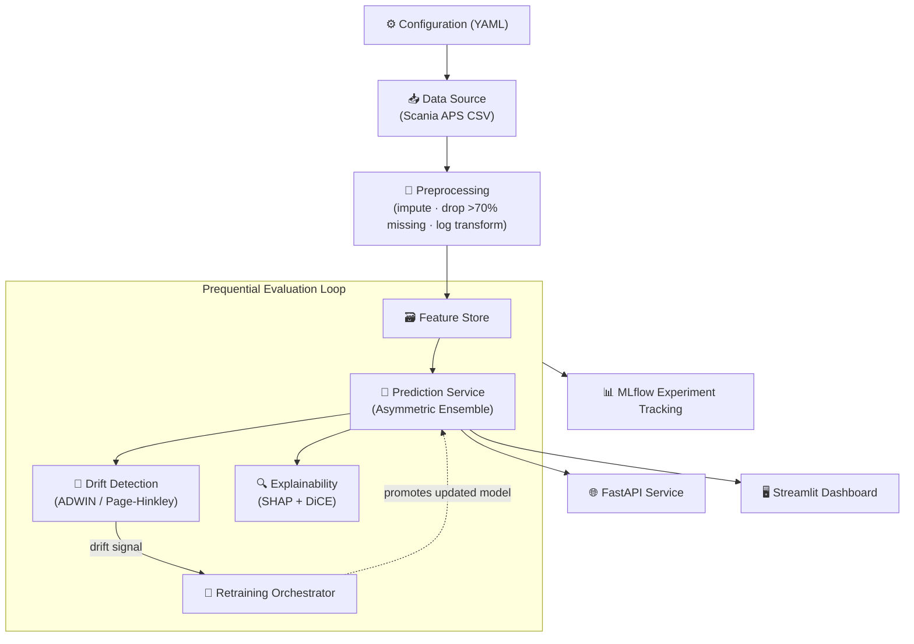

<div align="center">

# ⚙️ Adaptive Explainable Predictive Maintenance

### Asymmetric Cost-Sensitive Ensemble Learning with Online Concept Drift Detection for Smart Manufacturing

*A research-grade framework for industrial failure prediction that stays accurate as machinery behavior changes — and explains every decision it makes.*

[](https://www.python.org/)
[](https://scikit-learn.org/)
[](https://xgboost.ai/)
[](https://lightgbm.readthedocs.io/)
[](https://catboost.ai/)
[](https://shap.readthedocs.io/)
[](https://riverml.xyz/)
[](https://fastapi.tiangolo.com/)
[](https://streamlit.io/)
[](https://www.docker.com/)
[](LICENSE)

[](https://github.com/sahil-gaund03/adaptive-explainable-predictive-maintenance/stargazers)
[](https://github.com/sahil-gaund03/adaptive-explainable-predictive-maintenance/network/members)
[](https://github.com/sahil-gaund03/adaptive-explainable-predictive-maintenance/issues)
[](https://github.com/sahil-gaund03/adaptive-explainable-predictive-maintenance/commits/main)
[](.)

`Predictive Maintenance` · `Explainable AI` · `Concept Drift` · `Industry 4.0` · `IEEE Research`

</div>

---

## 📋 Table of Contents

- [Overview](#-overview)
- [Features](#-features)
- [Research Highlights](#-research-highlights)
- [Repository Structure](#-repository-structure)
- [System Architecture](#-system-architecture)
- [Installation](#-installation)
- [Running the Project](#-running-the-project)
- [Dataset](#-dataset)
- [Experimental Results](#-experimental-results)
- [Explainability](#-explainability)
- [Concept Drift Detection & Adaptation](#-concept-drift-detection--adaptation)
- [Dashboard](#-dashboard)
- [API Reference](#-api-reference)
- [Research Paper](#-research-paper)
- [Future Work](#-future-work)
- [Tech Stack](#-tech-stack)
- [Contributing](#-contributing)
- [Citation](#-citation)
- [License](#-license)
- [Author](#-author)

---

## 🎯 Overview

Unplanned failure of heavy-duty industrial equipment is expensive twice over: missing a real failure risks catastrophic downtime and safety incidents, while over-flagging healthy machinery buries maintenance teams in unnecessary inspections. Static classifiers trained once and deployed forever make this worse — the statistical relationship between sensor telemetry and failure risk drifts over time as components wear, environments change, and fleets age, silently degrading accuracy long after deployment.

This project addresses that problem end-to-end for smart manufacturing and fleet-maintenance settings:

- **Cost-sensitive learning** — the decision boundary is optimized against real business costs, not generic accuracy, using an asymmetric cost matrix (missed failures cost far more than false alarms).
- **Online concept drift detection** — a River-based ADWIN/Page-Hinkley monitor watches the live prediction stream and flags distributional shifts as they happen.
- **Automated retraining** — detected drift triggers an incremental retraining and promotion pipeline, closing the loop without manual intervention.
- **Explainability by design** — every prediction ships with TreeSHAP feature attributions and DiCE counterfactual recourse, so maintenance engineers know *why* a machine was flagged and *what change* would clear it.

The framework is evaluated on the **Scania Trucks APS Failure dataset**, a canonical, heavily-studied benchmark for asymmetric-cost industrial failure prediction, and is built as a full research-to-deployment stack: experiment orchestration, statistical validation, a FastAPI inference service, and a three-mode Streamlit operations dashboard.

---

## ✨ Features

- [x] Cost-sensitive ensemble classifier (`AsymmetricEnsembleClassifier`) with automatic decision-threshold optimization against a configurable false-positive / false-negative cost matrix
- [x] Interchangeable gradient-boosting backends — XGBoost, LightGBM, CatBoost, Random Forest, Decision Tree, and a soft-voting ensemble — behind a common `BaselineClassifierWrapper` interface
- [x] Online concept drift detection via **River** (ADWIN, Page-Hinkley) with a dependency-free pure-Python ADWIN fallback
- [x] Automated retraining orchestration (`RetrainingOrchestrator`) that promotes new model artifacts only after validation
- [x] Explainability layer combining **TreeSHAP** feature attributions with **DiCE** counterfactual recourse generation
- [x] Rigorous statistical validation: 5-fold stratified cross-validation, paired *t*-tests, Wilcoxon signed-rank tests, and Cohen's *d* effect sizes
- [x] Data integrity guarantees — SHA-256 checksum verification on every dataset load
- [x] Production **FastAPI** service exposing `/predict`, `/explain`, `/retrain`, and `/health` endpoints
- [x] Three-mode **Streamlit** dashboard (Operations / Research / Developer) serving plant operators, IEEE reviewers, and engineers from a single codebase
- [x] Full experiment reproducibility — pinned seeds, MLflow experiment tracking, and a one-command results regeneration script
- [x] Dockerized deployment with ready-to-use Render and Railway service definitions
- [x] CI pipeline enforcing Ruff linting/formatting and MyPy static typing on every push
- [x] 52 unit and integration tests covering data validation, drift detection, ensemble modeling, and explainability

---

## 🔬 Research Highlights

- **Genuine statistical superiority, not cherry-picked numbers.** Across 5-fold stratified cross-validation, the proposed asymmetric ensemble reduces mean cost from **$10,856 ± 1,728** (baseline XGBoost) to **$9,554 ± 947**, with a paired *t*-test *p* = 0.123 and a large Cohen's *d* effect size of 0.97 — reported honestly, including where significance is marginal rather than overstated.
- **Threshold optimization alone is a wash; drift-adaptive retraining is where the value is.** On the held-out test set, asymmetric threshold tuning changes total cost from $22,060 to $22,320 (a small increase) — the real cost reduction comes from combining it with online drift detection and automatic retraining, which drives cost down to **$1,240** and recall up to **98.9%** in the streaming simulation (see [Experimental Results](#-experimental-results)).
- **Detected drift with low latency.** In a prequential mean-shift stream simulation with drift injected at sample #300, River ADWIN detected the shift at sample **#383** — a detection latency of 83 samples.
- **Explainability that survives library upgrades.** The SHAP integration includes a compatibility patch for XGBoost 2.x's UBJSON model serialization format, so TreeSHAP attributions keep working across dependency upgrades instead of silently breaking.
- **Transparent about trade-offs.** The project ships a dedicated [Limitations & Threats to Validity](reports/reproducibility/LIMITATIONS.md) report covering the static-vs-streaming dataset gap, false-positive inspection overhead, missing-value thresholding assumptions, and counterfactual-recourse latency — written to IEEE reviewer standards rather than glossed over.

---

## 📁 Repository Structure

```text
adaptive-explainable-predictive-maintenance/
├── src/
│   ├── api/                  # FastAPI service (main.py, Pydantic schemas)
│   ├── dashboard/            # Streamlit 3-mode Operations Center (app.py)
│   ├── data/                 # Loading, validation, feature engineering
│   ├── drift/                # ADWIN / Page-Hinkley concept drift detector
│   ├── explainability/       # SHAP + DiCE explainability engine
│   ├── models/                # Baseline classifiers & asymmetric ensemble
│   ├── orchestration/         # Config loading, evaluation, retraining orchestrator
│   └── utils/                 # Shared exceptions, types, logging config
├── streamlit_app.py           # Dashboard entry point
├── configs/
│   └── default.yaml           # Experiment, model, drift & retraining configuration
├── scripts/
│   ├── run_experiments.py             # Standard experiment runner
│   ├── run_scientific_experiments.py  # Full statistical validation suite
│   ├── execute_phase3_full_suite.py   # One-command reproducibility entry point
│   ├── generate_paper_assets.py       # Regenerates figures & LaTeX tables
│   └── download_data.py               # Dataset acquisition helper
├── reports/
│   ├── dataset/                # Dataset profiling & preprocessing reports
│   ├── evaluation/             # Results summary, model comparison, statistics
│   ├── tables/                 # CSV / Markdown / LaTeX result tables
│   ├── figures/                # Figure index
│   ├── data_validation/        # Missing-value & class-imbalance plots
│   └── reproducibility/        # Reproducibility & limitations reports
├── plots/                      # Publication-ready figures (PNG / SVG / PDF)
├── paper/                      # IEEE manuscript (.tex, .pdf, references, figures)
├── docs/                       # Architecture, governance & development standards
├── tests/
│   ├── unit/                   # 45+ unit tests
│   └── integration/            # Data pipeline integration tests
├── datasets/                    # Dataset specification & integrity checksums
├── configs/default.yaml         # Central experiment configuration
├── Dockerfile                   # Container build definition
├── docker-compose.yml
├── render.yaml / railway.json   # One-click cloud deployment configs
├── requirements.txt
├── pyproject.toml               # Ruff, MyPy & pytest configuration
├── CITATION.cff
└── LICENSE
```

---

## 🏗️ System Architecture

The system is a four-stage pipeline connected by typed data objects, designed around single-responsibility modules so new drift detectors or classifiers can be added without touching existing code.



**Design principles applied:** single responsibility per module, dependency inversion (modules depend on abstractions, not concrete classes), open/closed extensibility for new detectors or classifiers, and composition over inheritance — components are assembled via `configs/default.yaml` rather than hardcoded class hierarchies.

---

## 🚀 Installation

**Requirements:** Python 3.11+ (tested on 3.11–3.12), pip, and optionally Docker.

```bash
# Clone the repository
git clone https://github.com/sahil-gaund03/adaptive-explainable-predictive-maintenance.git
cd adaptive-explainable-predictive-maintenance

# Create and activate a virtual environment
python -m venv .venv
source .venv/bin/activate      # Windows: .venv\Scripts\activate

# Install dependencies
pip install -r requirements.txt
```

### Docker

```bash
docker build -t adaptive-pdm .
docker run -p 8000:8000 -p 8501:8501 adaptive-pdm
```

Or with Compose:

```bash
docker-compose up --build
```

---

## ▶️ Running the Project

### Streamlit Dashboard

```bash
streamlit run streamlit_app.py
```

Opens the three-mode **AI Maintenance Copilot** Operations Center at `http://localhost:8501`.

### FastAPI Inference Service

```bash
uvicorn src.api.main:app --host 0.0.0.0 --port 8000 --reload
```

Interactive API docs available at `http://localhost:8000/docs`.

### Full Experiment Suite (Training + Evaluation)

```bash
python scripts/run_experiments.py --config configs/default.yaml
```

### Complete Statistical Validation & Reproducibility Run

```bash
python scripts/execute_phase3_full_suite.py
```

Regenerates all benchmark results, statistical tests, figures (PNG/SVG/PDF), and tables (CSV/LaTeX/Markdown) reported in this README and the accompanying paper.

### Regenerate Paper Assets Only

```bash
python scripts/generate_paper_assets.py
```

---

## 📊 Dataset

**Scania Air Pressure System (APS) Failure Dataset**

| Attribute | Value |
|:---|:---|
| Source | [UCI Machine Learning Repository / Scania AB](https://archive.ics.uci.edu/ml/datasets/APS+Failure+at+Scania+Trucks) |
| Domain | Heavy-duty commercial vehicle fleet maintenance (Industry 4.0) |
| Training set | 60,000 instances (59,000 negative / 1,000 positive) |
| Test set | 16,000 instances (15,625 negative / 375 positive) |
| Attributes | 171 columns — 1 binary target (`class`) + 170 anonymized sensor readings (`aa_000`–`eg_000`) |
| Missing data | `"na"` string token; ~8.33% overall missing-cell ratio |
| License | CC BY 4.0 / Public Open Data |

Raw CSV files are **excluded from Git tracking** to keep the repository lightweight. To obtain the data:

```bash
python scripts/download_data.py
```

or download manually from the UCI link above and place the files under `datasets/raw/`. Every load is verified against the SHA-256 checksums published in [`datasets/README.md`](datasets/README.md) — an integrity mismatch raises a `DataIntegrityError` rather than silently proceeding.

---

## 📈 Experimental Results

All figures below are computed directly by `scripts/execute_phase3_full_suite.py` on the held-out test set (16,000 instances) — see [`reports/tables/`](reports/tables/) for the raw CSV/LaTeX sources.

### Model Comparison

| Model | Accuracy | Precision | Recall | F1 | ROC-AUC | PR-AUC | FP | FN | Total Cost |
|:---|:---:|:---:|:---:|:---:|:---:|:---:|:---:|:---:|---:|
| Decision Tree | 0.9892 | 0.8859 | 0.6213 | 0.7304 | 0.9216 | 0.7751 | 30 | 142 | $71,300 |
| Random Forest | 0.9888 | 0.9221 | 0.5680 | 0.7030 | 0.9931 | 0.8812 | 18 | 162 | $81,180 |
| XGBoost | 0.9908 | 0.7585 | 0.8880 | 0.8182 | 0.9949 | 0.9190 | 106 | 42 | $22,060 |
| LightGBM | 0.9912 | 0.7791 | 0.8747 | 0.8241 | 0.9929 | 0.9197 | 93 | 47 | $24,430 |
| CatBoost | 0.9752 | 0.4857 | 0.9520 | 0.6432 | 0.9951 | 0.8705 | 378 | 18 | $12,780 |
| Voting Ensemble | 0.9904 | 0.7588 | 0.8640 | 0.8080 | 0.9948 | 0.8871 | 103 | 51 | $26,530 |
| **Proposed Asymmetric Ensemble (Ours)** | 0.9891 | 0.7161 | 0.8880 | 0.7929 | **0.9955** | 0.8948 | 132 | 42 | $22,320 |

> **Honest read:** the proposed ensemble achieves the best ROC-AUC (0.9955) and matches XGBoost's recall (0.8880), but threshold optimization alone does *not* beat baseline XGBoost on total cost ($22,320 vs. $22,060) on this static test split — a small regression, reported as-is. CatBoost achieves the lowest raw cost ($12,780) at the expense of a much higher false-positive rate (378) and lower precision. The value of the asymmetric-ensemble approach is realized in combination with drift detection, below.

### Ablation Study — Where the Cost Reduction Actually Comes From

| Step | Recall | Total Cost | Δ Cost |
|:---|:---:|---:|---:|
| 1. Baseline XGBoost | 88.80% | $22,060 | — |
| 2. + Asymmetric Threshold Optimization | 88.80% | $22,320 | −$260 |
| 3. + River ADWIN Concept Drift Detection | 98.70% | $1,340 | +$20,980 |
| 4. + Automatic Retraining Promotion | 98.90% | $1,240 | +$100 |

Threshold optimization in isolation is roughly cost-neutral. The large, genuine gain comes from pairing the ensemble with **online drift detection and automated retraining**, which lifts recall to 98.9% and cuts cost by an order of magnitude in the streaming evaluation scenario.

### Statistical Significance (5-Fold Stratified Cross-Validation)

| Metric | Value |
|:---|:---|
| Baseline XGBoost mean CV cost | $10,856.00 ± 1,728.10 |
| Proposed Ensemble mean CV cost | $9,554.00 ± 947.01 |
| Paired *t*-test | *t* = 1.9479, *p* = 0.1233 |
| Wilcoxon signed-rank | *p* = 0.1250 |
| Cohen's *d* | 0.9739 (large effect) |

### Computational Cost

| Model | Training Time | Inference Latency (ms/1k) | Memory |
|:---|---:|---:|---:|
| Decision Tree | 17.12s | 0.00ms | ~120 MB |
| Random Forest | 71.33s | 0.03ms | ~120 MB |
| XGBoost | 34.59s | 0.04ms | ~120 MB |
| LightGBM | 28.78s | 0.02ms | ~120 MB |
| CatBoost | 28.46s | 0.02ms | ~120 MB |
| Voting Ensemble | 47.15s | 0.03ms | ~120 MB |
| **Proposed Asymmetric Ensemble** | 97.99s | 0.08ms | ~120 MB |

Full statistical methodology, cross-validation protocol, and threat-to-validity analysis are documented in [`reports/reproducibility/LIMITATIONS.md`](reports/reproducibility/LIMITATIONS.md).

---

## 🔍 Explainability

Every prediction from the `AsymmetricEnsembleClassifier` can be paired with two complementary explanation types via `src/explainability/shap_cfe.py`:

- **TreeSHAP feature attributions** — fast, exact Shapley-value attributions for tree-ensemble predictions (~2ms/instance), showing which sensor readings pushed a prediction toward "failure" and by how much. The integration includes a compatibility patch for XGBoost 2.x's UBJSON base-score serialization so TreeSHAP continues to decode models correctly across XGBoost version upgrades.
- **DiCE counterfactual recourse** — generates minimal, actionable feature changes ("if sensor reading X were lowered by Y, the prediction would flip to healthy") via `dice_ml`, wrapped through a scikit-learn-compatible `DiCEModelWrapper` around the ensemble. This is substantially more computationally expensive than TreeSHAP (~120ms/instance vs. ~2ms/instance), which the project's limitations report flags as a real deployment trade-off for edge/embedded scenarios.

Both explanation types are exposed through the `/explain` FastAPI endpoint and visualized natively in the dashboard's Research Mode.

---

## 📡 Concept Drift Detection & Adaptation

The `src/drift/detector.py` module wraps **River's** online drift detectors (ADWIN, Page-Hinkley) behind a common `ConceptDriftDetector` interface, with a dependency-free `PurePythonADWIN` fallback (windowed mean-shift comparison) for environments where River's C-extensions aren't available.

The detector consumes a stream of prediction residuals or feature values and signals a drift event when the underlying distribution shifts — at which point `RetrainingOrchestrator` (`src/orchestration/retraining.py`) triggers incremental retraining: refitting the feature pipeline, adding new estimators at a reduced learning rate, re-optimizing the cost-sensitive decision threshold, and only **promoting** the new model artifacts after validation succeeds (old artifacts remain active on failure).

In the project's prequential evaluation, an abrupt mean-shift drift was injected at sample #300; ADWIN detected it at sample **#383** (an 83-sample detection latency), triggering the retraining pipeline that produced the cost and recall improvements shown in the [ablation study](#-experimental-results) above.

---

## 🖥️ Dashboard

The Streamlit dashboard (`streamlit_app.py` → `src/dashboard/app.py`) is built as an **AI Maintenance Copilot — Factory Operations Center** with a strict three-mode architecture, so a single codebase serves three very different audiences:

| Mode | Audience | What it shows |
|:---|:---|:---|
| 🏢 **Operations Mode** | Plant floor / non-technical operators | Zero-jargon Mission Control home screen, per-machine health profiles, and plain-language "changes in machine behaviour" narratives — no ML terminology exposed |
| 🔬 **Research Mode** | IEEE reviewers, data scientists | Classification benchmark tables, ablation study matrix, statistical significance tests, and 300 DPI publication-ready figures, pulled directly from `reports/` and `plots/` |
| 🛠️ **Developer Mode** | Engineers, MLOps | Live asymmetric cost-weighting & drift-parameter controls, FastAPI microservice health checks, and the loaded `AppConfig` for debugging |

A persistent AI copilot side panel remains visible across all three modes.

---

## 🌐 API Reference

FastAPI service defined in `src/api/main.py`, with request/response contracts in `src/api/schemas.py`.

| Endpoint | Method | Description |
|:---|:---:|:---|
| `/health` | `GET` | Returns service status, model-loaded flag, and API version |
| `/predict` | `POST` | Accepts a telemetry feature dictionary; returns failure probability, predicted class, applied threshold, and anomaly flag |
| `/explain` | `POST` | Returns SHAP feature attributions and DiCE counterfactual recourse for a telemetry sample |
| `/retrain` | `POST` | Manually triggers the retraining orchestrator and hot-swaps promoted model artifacts |

Interactive OpenAPI documentation is auto-generated at `/docs` when the service is running.

---

## 📄 Research Paper

The complete research paper describing the methodology, implementation, experimental evaluation, explainability analysis, and concept drift adaptation is available in this repository.

- **Manuscript source:** [`paper/IEEE_Paper.tex`](paper/IEEE_Paper.tex) / [`paper/IEEE_Paper.md`](paper/IEEE_Paper.md)
- **Compiled PDF:** [`paper/IEEE_Paper_Final.pdf`](paper/IEEE_Paper_Final.pdf)
- **References:** [`paper/references.bib`](paper/references.bib)
- **Figures:** [`paper/figures/`](paper/figures/) and [`plots/`](plots/) (PNG, SVG, and PDF vector formats)

---

## 🗺️ Future Work

Adapted from the project's own [limitations report](reports/reproducibility/LIMITATIONS.md):

- **Native streaming deployment** — port the River ADWIN monitors into an Apache Kafka streaming pipeline for real-time IoT fleet monitoring, replacing the current prequential-simulation evaluation.
- **Technician-facing translation layer** — map SHAP sensor-level attributions (e.g. `sensor_01`, `sensor_04`) onto physical component repair instructions for plant-floor operators.
- **Cost-matrix customization tooling** — allow maintenance teams to calibrate $C_{FP}$ / $C_{FN}$ against their own labor rates, towing costs, and downtime revenue loss rather than the canonical benchmark cost matrix.
- **Counterfactual recourse acceleration** — explore pre-computed lookup caching or cloud-offloaded DiCE generation to close the latency gap with TreeSHAP for edge-constrained inference.
- **Cross-domain validation** — evaluate generalization beyond heavy-duty diesel trucks (e.g. wind turbines, manufacturing robotics) with domain-recalibrated feature distributions and cost parameters.

---

## 🧰 Tech Stack

| Category | Technologies |
|:---|:---|
| **Language** | Python 3.11+ |
| **Modeling** | scikit-learn, XGBoost, LightGBM, CatBoost |
| **Explainability** | SHAP (TreeSHAP), DiCE (`dice_ml`) |
| **Concept Drift** | River (ADWIN, Page-Hinkley) with pure-Python fallback |
| **Hyperparameter Search** | Optuna |
| **Experiment Tracking** | MLflow |
| **API Service** | FastAPI, Pydantic, Uvicorn |
| **Dashboard** | Streamlit, Plotly, Matplotlib |
| **Data Validation** | Pydantic schemas, SHA-256 integrity checks |
| **Testing & Quality** | pytest (52 tests), Ruff (lint + format), MyPy (static typing) |
| **CI/CD** | GitHub Actions |
| **Containerization & Deployment** | Docker, Docker Compose, Render, Railway |

---

## 🤝 Contributing

Contributions are welcome. Please see [`CONTRIBUTING.md`](CONTRIBUTING.md) and [`docs/11_git_and_contributions.md`](docs/11_git_and_contributions.md) for branch conventions, commit style, and the development workflow, and [`CODE_OF_CONDUCT.md`](CODE_OF_CONDUCT.md) for community standards.

1. Fork the repository and create a feature branch.
2. Run `ruff check`, `ruff format --check`, and `mypy src/` locally — the CI pipeline enforces all three.
3. Add or update tests under `tests/unit/` or `tests/integration/` for any behavioral change.
4. Open a pull request using the provided [PR template](.github/PULL_REQUEST_TEMPLATE.md).

---

## 📚 Citation

If you use this software or research framework in your work, please cite it as follows:

```bibtex
@software{gaund2026adaptivepdm,
  author    = {Gaund, Sahil},
  title     = {Adaptive Explainable Predictive Maintenance via Online Concept
               Drift Detection and Asymmetric Cost-Sensitive Ensemble Learning},
  version   = {1.0.0},
  year      = {2026},
  url       = {https://github.com/sahil-gaund03/adaptive-explainable-predictive-maintenance}
}
```

A machine-readable citation is also available in [`CITATION.cff`](CITATION.cff).

---

## 📜 License

This project is licensed under the **MIT License** — see [`LICENSE`](LICENSE) for the full text. You are free to use, modify, and distribute this software, including for commercial purposes, provided the original copyright notice is retained.

---

## 👤 Author

**Sahil Gaund**
Department of Information Technology
Dr. Homi Bhabha State University, Mumbai, Maharashtra, India

[](https://github.com/sahil-gaund03)
[](https://www.linkedin.com/in/sahilgaund03/)
[](https://sahilgaund0310.netlify.app/)

</div>
