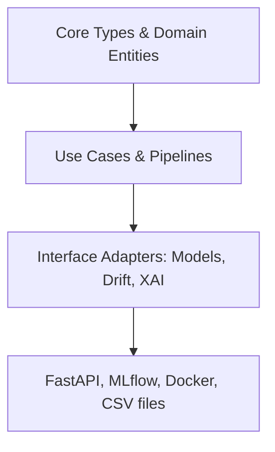
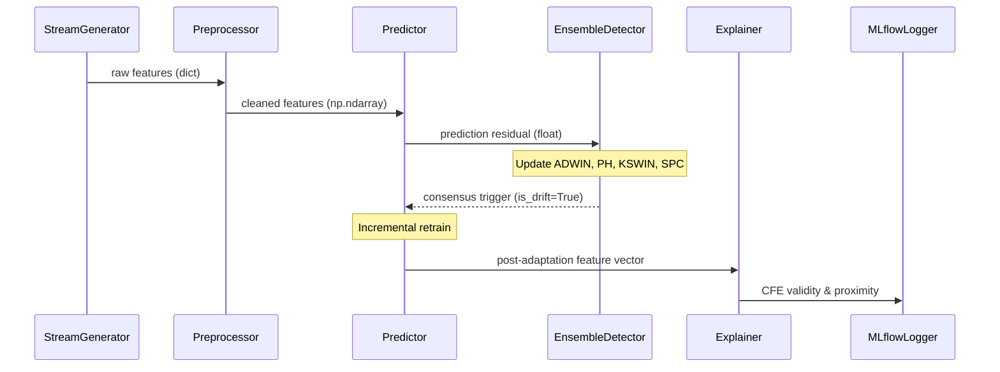

# Clean Architecture & Code Design

This document governs the software architecture, design patterns, module divisions, and dependency flows within the codebase.

---

## 1. Clean Architecture Principles

The codebase is organized into concentric layers representing levels of abstraction. Dependencies flow inward: **inner layers cannot depend on or know about outer layers**.



### 1.1 Layer Definitions

#### 1. Core Domain / Entities (`src/utils/types.py` & `src/utils/metrics.py`)
* The innermost layer. Defines basic business types (Pydantic schemas like `SampleData` and `PredictionResult`) and domain-specific operations (e.g., cost matrix calculations).
* **Rule:** Contains zero imports from other modules in the codebase. Depends only on standard libraries or basic third-party utility packages (Pydantic, NumPy).

#### 2. Interface Adapters (`src/data/`, `src/models/`, `src/drift/`, `src/explainability/`)
* Contains wrappers and implementations of ML algorithms, drift detectors, and XAI generators. These modules transform raw data into domain types and model-specific formats.
* **Rule:** Adapters are isolated from one another. The drift detection module does not import the models module; instead, it communicates via common primitives (residuals) passed through the Orchestration layer.

#### 3. Orchestration / Use Cases (`src/orchestration/`)
* Orchestrates data flow between interface adapters. Houses the prequential evaluation loop (`pipeline.py`) and multi-seed run execution (`experiment_runner.py`).
* **Rule:** Coordination logic belongs here. The pipeline imports the loader, predictor, drift detector, and explainer, feeding the outputs of one into the inputs of the next.

#### 4. Infrastructure (`src/api/`, `scripts/`, YAML configs)
* The outermost layer. Includes FastAPI server routing, configuration files, and launch scripts.
* **Rule:** Changes to infrastructure (e.g., replacing FastAPI with another REST library or changing the CLI args parser) must not require changes to the inner layers.

---

## 2. SOLID Design Standards

We strictly enforce the five SOLID principles in our Python modules:

* **S - Single Responsibility Principle (SRP):** Each class and module must have exactly one reason to change. 
  * *Example:* The `data_loader.py` handles reading and verification; the `data_preprocessor.py` handles imputation and transforms. They are separate files.
* **O - Open/Closed Principle (OCP):** Software components must be open for extension but closed for modification.
  * *Example:* The `model_factory.py` instantiates classifiers from a string mapping. Adding a new classifier model type only requires expanding the factory dictionary, leaving existing prediction pipelines untouched.
* **L - Liskov Substitution Principle (LSP):** Subclasses must be substitutable for their base classes.
  * *Example:* All base classifiers (XGBoost, LightGBM, CatBoost) must expose identical `.fit()` and `.predict_proba()` behaviors via a standardized Python `Protocol` or abstract class.
* **I - Interface Segregation Principle (ISP):** Clients must not be forced to depend on methods they do not use.
  * *Example:* The `EnsembleDetector` exposes a clean, minimal `.update(value: float) -> DriftSignal` interface, hiding the underlying complexity of individual statistical tests.
* **D - Dependency Inversion Principle (DIP):** Depend on abstractions, not on concretions. High-level modules must not depend on low-level modules.
  * *Example:* The `orchestration/pipeline.py` accepts a configured classifier instance rather than constructing one internally, allowing dependency injection.

---

## 3. Dependency Injection Pattern

Hardcoding dependencies inside classes is forbidden. All dependencies must be injected via construction parameters:

```python
# GOOD: Dependency Injection
class PrequentialPipeline:
    def __init__(
        self,
        classifier: CostSensitivePredictor,
        drift_detector: EnsembleDetector,
        explainer: CounterfactualGenerator,
        preprocessor: DataPreprocessor,
        config: dict
    ):
        self.classifier = classifier
        self.drift_detector = drift_detector
        self.explainer = explainer
        self.preprocessor = preprocessor
        self.config = config

# BAD: Hardcoded instantiation inside constructor
class PrequentialPipeline:
    def __init__(self, config: dict):
        self.classifier = XGBClassifier(...) # Violates Dependency Inversion
        self.drift_detector = ADWIN(...)    # Violates Open/Closed
```

---

## 4. Pipeline Data Flow

The sequential flow of data during one iteration of the prequential loop is as follows:


