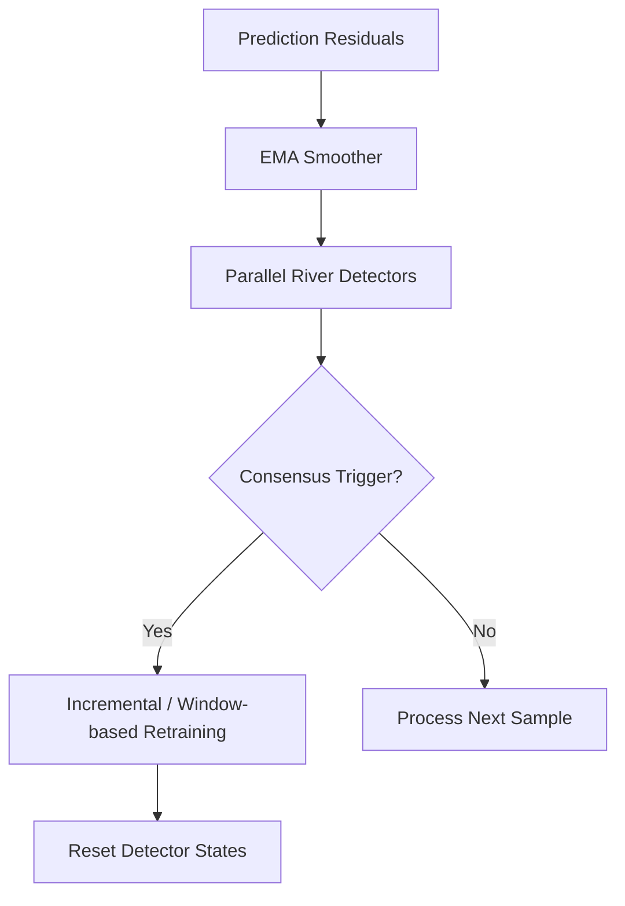

# Machine Learning & MLOps Standards

This document establishes engineering rules for data pipelines, model optimization, drift detection mechanisms, explainability protocols, experiment tracking, and deployment runtimes.

---

## 1. Machine Learning Lifecycle Standards

### 1.1 Data Validation
* Incoming data streams must be validated against a strict schema before inference using **Pydantic**.
* Preprocessing operations (imputation, log-transforms, scaling) must use stateful estimators (e.g., Scikit-Learn `SimpleImputer` or `StandardScaler`) fitted strictly on training data splits to prevent **data leakage**.

### 1.2 Feature Engineering
* Anonymized features must not be arbitrarily modified or combined without statistical justification.
* Feature importance rankings must be calculated using exact TreeSHAP attributions derived from baseline classifiers to guide feature selection for drift simulation.

### 1.3 Model Selection & Hyperparameter Optimization
* Optimization is orchestrated using **Optuna** with Tree-structured Parzen Estimator (TPE) search.
* The objective function must target validation-fold **Total Maintenance Cost** reduction rather than generic accuracy or ROC-AUC:
$$\text{Cost} = (FP \times \$10) + (FN \times \$500)$$
* All optimization trials must utilize 5-fold stratified cross-validation.

### 1.4 Decision Threshold Calibration
* Defaulting classification thresholds to $0.5$ is strictly prohibited.
* After model training, the decision threshold $\tau$ must be swept over 1000 evenly spaced points in $[0, 1]$ to identify the mathematically optimal threshold $\tau^*$ that minimizes total maintenance cost on validation data:
$$\tau^* = \arg\min_{\tau} \text{TotalCost}(\tau)$$

---

## 2. Concept Drift & Retraining Strategy

### 2.1 Online Concept Drift Monitoring
* The drift detection service monitors prediction residuals smoothed via an Exponential Moving Average (EMA) with a default window size of 50 samples.
* Monitored residuals are evaluated in parallel by four statistical detectors:
  * **ADWIN** (checks window statistics shift)
  * **Page-Hinkley** (checks cumulative sum shift)
  * **KSWIN** (checks Kolmogorov-Smirnov distance)
  * **SPC** (checks control limits)
* Drift is triggered strictly by a **3-of-4 consensus mechanism** to control False Positive Rates (FPR) under $0.5\%$.

### 2.2 Retraining Architecture
Upon drift consensus:
1. **Incremental Retraining (Primary):** The model updates by appending 10-20% additional estimators with the learning rate scaled down by half ($\eta_{retrain} = 0.5 \times \eta_{initial}$) using XGBoost's `xgb_model` parameter.
2. **Window-based Retraining (Baseline):** A sliding window of the most recent 2000 samples is used to train a fresh model from scratch.
3. **Detector Reset:** All statistical windows and cumulative sums in the River detectors are fully reset post-adaptation.

---

## 3. Explainability (XAI) Standards

* **Diverse Counterfactuals:** For every positive failure prediction (Class 1), we generate four diverse counterfactual explanations using **DiCE**.
* **CFE Constraints:** CFEs must respect the physical range of features (non-negative limits) and utilize the `random` generation method for continuous tabular attributes.
* **Explanation Stability Metrics:** CFE quality is quantified across drift cycles. The `ExplanationEvaluator` must report:
  * **Validity Rate:** Percentage of CFEs that flip the model prediction to safe (Class 0).
  * **Proximity:** L1 distance between the original sample and the counterfactual.
  * **Sparsity:** The average count of features altered in the counterfactual recommendations.
  * **Feature Overlap:** The intersection of modified feature names between pre-drift and post-drift explanations for identical sample states.

---

## 4. MLOps, Artifacts & Tracking Standards

### 4.1 Experiment Tracking (MLflow)
* All training and evaluation runs must be logged to a local **MLflow** tracking server.
* The following entities must be captured:

| Category | Logged Value |
| :--- | :--- |
| **Parameters** | Feature count, imputer state, HPO parameters, drift simulation magnitude, drift feature subset. |
| **Metrics** | Total maintenance cost, recall, precision, F1-score, ROC-AUC, FPR, detection latency, CFE validity, CFE feature overlap. |
| **Artifacts** | Config YAML snapshot, final XGBoost JSON model, preprocessor pickle states, matplotlib performance figures. |

### 4.2 Model Versioning & Registry
* Model states are versioned implicitly via their MLflow run IDs.
* The experiment configuration, preprocessing imputer parameters, and classification model are packed together as a single MLflow pipeline run artifact to guarantee containerized reproducibility.

### 4.3 Container Runtimes (Docker)
* To guarantee absolute environmental reproducibility, the execution environment must run inside a Docker container built on a pinned base image (`python:3.11-slim`).
* Docker compose is used to launch the prequential evaluation experiments, FastAPI service, and MLflow tracking server locally or on cloud providers.
