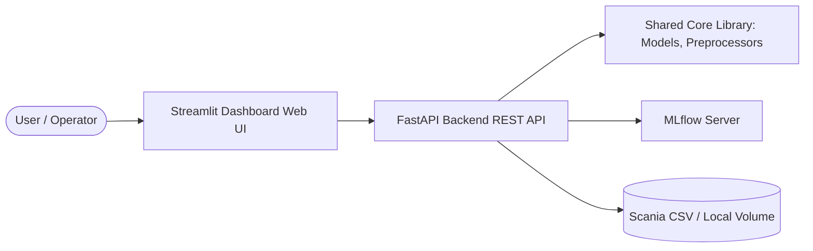
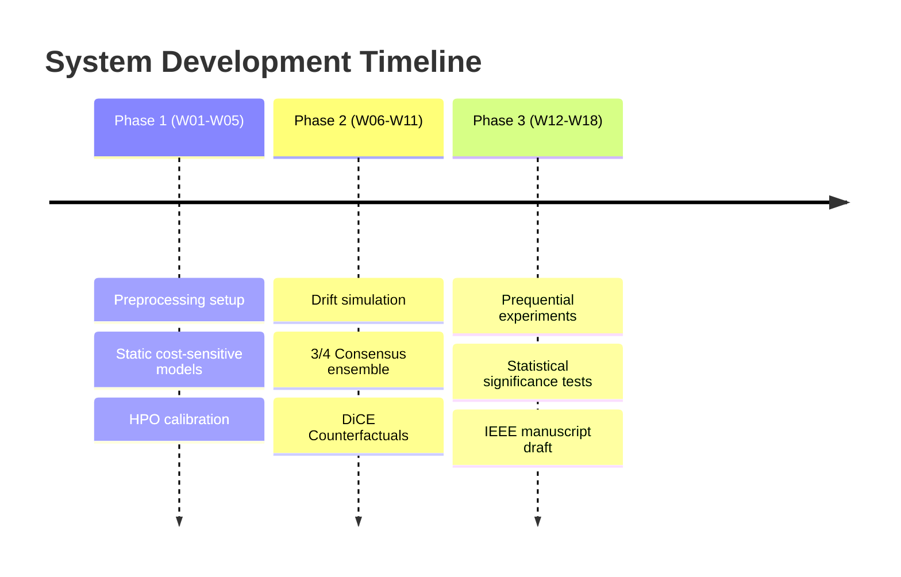

# Deployment & Future System Roadmap

This document outlines the containerized deployment architecture, API endpoints, web monitoring dashboard layout, environment configuration, and future roadmap phases.

---

## 1. System Deployment Architecture (V1)

Although this is a research-centric codebase, the system is designed to deploy as a production-ready application.



### 1.1 Backend REST Service (FastAPI)
The backend manages inferences and explainability generation. It is packaged as a Python service exposing the following primary endpoints:
* `POST /predict`: Evaluates incoming sensor arrays and returns class (0/1), probability, and expected maintenance cost.
* `POST /explain`: Generates four diverse counterfactuals (DiCE) and TreeSHAP feature importances.
* `GET /health`: Basic service status check.

### 1.2 Web Interface (Streamlit)
The Streamlit frontend serves as an operational dashboard for plant technicians. It connects to the FastAPI backend to display:
1. **Real-time Monitoring:** Graphs showing predictions, probabilities, and cumulative maintenance costs.
2. **Drift Status:** A diagnostic timeline highlighting individual detector alerts, consensus state, and last model retraining event.
3. **Actionable Recommendations:** Clean tables mapping counterfactual changes directly to physical truck sensors, helping technicians understand the required adjustments.

### 1.3 Hosting & Deployment Strategy
The system runs in a containerized environment using **Docker Compose**:
* **Railway / Render:** The FastAPI and MLflow backend containers can be deployed to Render or Railway via Git integrations.
* **Streamlit Community Cloud:** The frontend UI can be deployed directly via Streamlit's cloud infrastructure, connecting to the FastAPI backend over HTTPS.

---

## 2. Environment Configuration

All environment-specific parameters reside in a `.env` file (which is gitignored). Use `src/utils/config_loader.py` to parse these variables:

```bash
# .env.example
APP_ENV=development
PORT=8000
HOST=0.0.0.0

# Path settings
DATA_DIR=data/raw
MODEL_OUTPUT_DIR=outputs/models

# MLflow config
MLFLOW_TRACKING_URI=http://localhost:5000
MLFLOW_EXPERIMENT_NAME=adaptive_pdm_smart_factory

# Model parameters
DEFAULT_SEED=42
DEFAULT_CLASSIFIER=xgboost
```

---

## 3. Future Cloud Migration Path

Should this system transition to a corporate enterprise environment, we establish the following cloud migration blueprint:

* **AWS Architecture:**
  * Stream processing: AWS Kinesis.
  * Inference & Training: AWS SageMaker.
  * API Layer: Amazon ECS (Fargate) + API Gateway.
  * Model Registry: SageMaker Model Registry.
* **Azure Architecture:**
  * Stream processing: Azure Event Hubs.
  * Inference & Training: Azure Machine Learning Services.
  * API Layer: Azure Kubernetes Service (AKS).
  * Storage: Azure Blob Storage.

---

## 4. Multi-Phase System Roadmap

The development of the codebase is structured into three clear phases:



### Phase 1: Foundation (Weeks 1–5)
* Implement loaders, imputers, log transforms, and schema validators.
* Train and baseline cost-sensitive XGBoost, LightGBM, and CatBoost models.
* Complete threshold sweeps to minimize static maintenance costs.

### Phase 2: Adaptation & Explanations (Weeks 6–11)
* Inject abrupt and gradual concept drifts.
* Build the ADWIN, PH, KSWIN, and SPC consensus ensemble.
* Integrate DiCE to generate and evaluate counterfactuals.
* Operationalize the end-to-end prequential evaluation loop.

### Phase 3: Validation & Publication (Weeks 12–18)
* Run 20 seeds across all configurations.
* Perform Wilcoxon/Friedman statistical tests.
* Draft the publication-grade IEEE conference paper.
* Finalize containerization, testing pipelines, and documentation.
