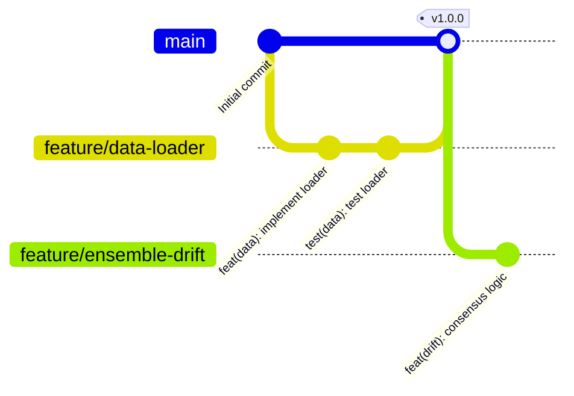

# Git Standards & Contribution Guidelines

This document governs the version control procedures, branching models, commit structures, pull request templates, and code review guidelines for the repository.

---

## 1. Version Control & Branching Strategy

We use a Git-based workflow optimized for clean histories and reproducible experiment tracking.



### 1.1 Branch Naming Conventions
* **Trunk Branch:** `main`. Must always be deployable, stable, and pass all test suites. Direct push access is locked.
* **Feature Branches:** Short-lived branches dedicated to a single feature, bug, or experiment configuration.
  * Prefix formats:
    * New features: `feature/[component]-[feature-description]` (e.g., `feature/data-imputation`)
    * Bug fixes: `bugfix/[component]-[fix-description]` (e.g., `bugfix/drift-adwin-reset`)
    * Refactoring: `refactor/[component]-[description]` (e.g., `refactor/utils-metrics-speed`)
    * Experiment configurations: `experiment/E[1-8]-[description]` (e.g., `experiment/E3-drift-latencies`)

---

## 2. Commit Message Guidelines

We use **Conventional Commits 1.0.0** to generate readable commit logs and automate changelogs.

### 2.1 Commit Structure
```
<type>(<scope>): <description>

[Optional Body describing technical details or reasoning]

[Optional Footers linking to issue tracker or ADRs]
```

### 2.2 Allowed Commit Types
* `feat`: A new feature (e.g., adding CatBoost to model factory).
* `fix`: A bug fix (e.g., fixing division-by-zero in sparsity calculation).
* `docs`: Documentation modifications (e.g., updating ADR files).
* `style`: Formatting changes that do not affect code logic (e.g., trailing whitespace removal).
* `refactor`: Code changes that neither fix bugs nor add features (e.g., renaming variables).
* `test`: Adding or correcting tests (e.g., test coverage additions).
* `chore`: Project configuration adjustments (e.g., updating `requirements.txt`).

### 2.3 Commit Examples
* `feat(models): add LightGBM class integration`
* `fix(drift): reset KSWIN window statistics on retraining`
* `test(explainability): add validity test for DiCE generator`

---

## 3. Pull Request (PR) Guidelines

All changes to `main` must be merged via Pull Requests. 

### 3.1 PR Requirements
* A PR must target a single feature or fix (no massive multi-component commits).
* Before submitting the PR, the branch must pass:
  - Formatter checks: `ruff format .`
  - Linter checks: `ruff check .`
  - Type checks: `mypy src/`
  - Test suites: `pytest tests/ --cov=src`
* Every PR must use the template below.

### 3.2 Pull Request Template

```markdown
# Pull Request Description

* **Target Feature / Component:** [e.g., Preprocessing Imputation]
* **Linked Issue / ADR:** [e.g., Closes #12 or ADR #0003]

## Summary of Changes
[Describe what technical problems were solved, design patterns implemented, or experiment configurations introduced.]

## Verification & Testing
* **Test Suite Output:** [Paste screenshot or execution snippet of passing pytest output]
* **Coverage Change:** [e.g., Coverage increased from 82% to 84%]

## Checklist
- [ ] Code is formatted using `ruff format .`
- [ ] Linter check `ruff check .` passes with zero errors
- [ ] Type check `mypy src/` returns zero errors
- [ ] All unit and integration tests pass
- [ ] Google-style docstrings are present for all new public functions
- [ ] No hardcoded configuration parameters or credentials
```

---

## 4. Pull Request Review Checklist

Reviewers must verify the following items before approving any merge to `main`:

* **Clean Architecture:** Does the code maintain dependency isolation? (e.g., check that no low-level API files or database wrappers are imported in the domain models).
* **Open/Closed Compliance:** Can new features or models be added without altering existing pipelines?
* **Zero Hardcoding:** Are all thresholds, limits, directories, and parameters mapped to the configuration YAML file?
* **Exception Design:** Are errors handled gracefully using explicit, domain-specific exceptions?
* **Scientific Integrity:** If this change alters an experiment split, cross-validation parameter, or cost matrix, does it contradict the research roadmap or previously approved decisions?
* **Unit Tests Coverage:** Are there matching test cases verifying edge inputs, null values, and extreme ranges?
